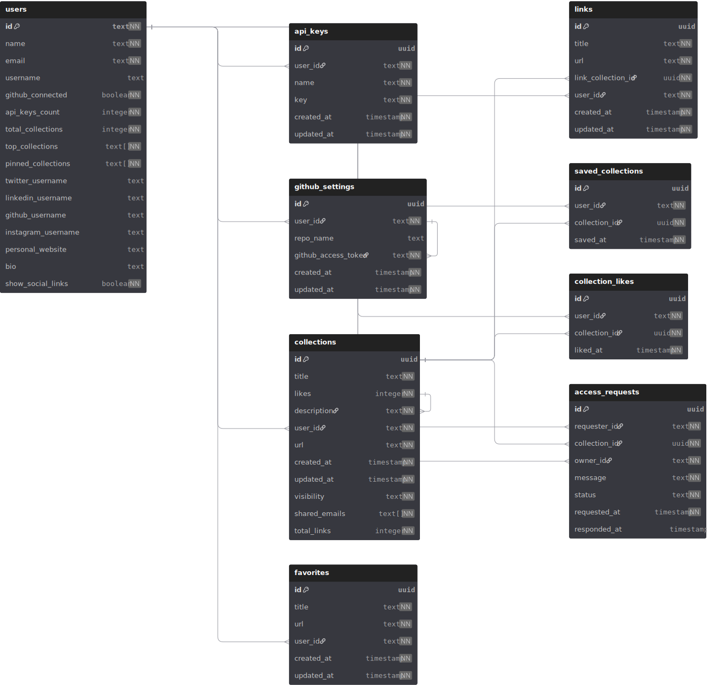

# Cur8t

> **Curate your stuff with Cur8t** - just a stupid side project turned into something that might be useful

[](https://opensource.org/licenses/MIT)
[](https://nextjs.org/)
[](https://reactjs.org/)
[](https://fastapi.tiangolo.com/)
[](https://www.typescriptlang.org/)

## 📋 Table of Contents

- [🎯 What's Cur8t?](#whats-cur8t)
  - [The Problem](#the-problem)
  - [The Solution](#the-solution)
- [🚀 What Can You Do?](#what-can-you-do)
  - [🧠 Smart Organization](#-smart-organization)
  - [🔌 Browser Integration](#-browser-integration)
  - [👥 Sharing & Collaboration](#-sharing--collaboration)
  - [🛠️ Developer Features](#️-developer-features)
  - [📊 Analytics & Insights](#-analytics--insights)
  - [🔧 Advanced Features](#-advanced-features)
- [✨ Collection Features Deep Dive](#-collection-features-deep-dive)
  - [📁 Collection Management](#-collection-management)
  - [🎯 Core Collection Actions](#-core-collection-actions)
  - [⚙️ Collection Actions Menu](#️-collection-actions-menu)
- [🎨 User Interface Features](#-user-interface-features)
  - [🎛️ Dashboard Overview](#️-dashboard-overview)
  - [🔍 Search & Discovery](#-search--discovery)
  - [📱 Mobile Responsive](#-mobile-responsive)
- [🛠️ Technical Features](#️-technical-features)
  - [🔐 Authentication & Security](#-authentication--security)
  - [⚡ Performance Optimizations](#-performance-optimizations)
  - [🔄 Real-time Features](#-real-time-features)
- [🏗️ Architecture](#️-architecture)
  - [🎨 Frontend (Next.js)](#-frontend-nextjs)
  - [🤖 Backend (FastAPI)](#-backend-fastapi)
  - [🗄️ Database](#️-database)
  - [🔌 APIs](#-apis)
- [📊 Database Schema](#database-schema)
- [🔄 How It Works](#how-it-works)
  - [The Stack](#the-stack)
  - [The Architecture](#the-architecture)
  - [Project Structure](#project-structure)
    - [🎨 cur8t-web (Next.js Frontend)](#-cur8t-web-nextjs-frontend)
    - [🤖 agents-api (FastAPI AI Agents)](#-agents-api-fastapi-ai-agents)
    - [🔌 extension-api (FastAPI Extension Backend)](#-extension-api-fastapi-extension-backend)
    - [🔧 Browser Extension (React + TypeScript)](#-browser-extension-react--typescript)
  - [Data Flow](#data-flow)
- [🚀 Getting Started](#-getting-started)
  - [📋 Prerequisites](#-prerequisites)
  - [🔧 Installation](#-installation)
  - [⚙️ Configuration](#️-configuration)
  - [🌐 Environment Variables](#-environment-variables)
- [🛠️ Development](#️-development)
  - [📁 Project Structure](#-project-structure)
  - [🔧 Development Setup](#-development-setup)
  - [🧪 Testing](#-testing)
  - [📦 Deployment](#-deployment)
- [🔌 API Documentation](#-api-documentation)
  - [🔑 Authentication](#-authentication)
  - [📚 Collections API](#-collections-api)
  - [🔗 Links API](#-links-api)
  - [👤 Users API](#-users-api)
- [🤖 AI Agents](#-ai-agents)
  - [📰 Article Extractor](#-article-extractor)
  - [📚 Bookmark Importer](#-bookmark-importer)
  - [🎯 Collection Generator](#-collection-generator)
  - [📤 Smart Export](#-smart-export)
  - [⏰ Watch Later Organizer](#-watch-later-organizer)
  - [📺 YouTube Extractor](#-youtube-extractor)
- [🔧 Browser Extension](#-browser-extension)
  - [📱 Features](#-features)
  - [🛠️ Installation](#️-installation)
  - [⚙️ Configuration](#️-configuration-1)
- [📊 Analytics & Monitoring](#-analytics--monitoring)
  - [📈 Usage Analytics](#-usage-analytics)
  - [🔍 Error Tracking](#-error-tracking)
  - [⚡ Performance Monitoring](#-performance-monitoring)
- [🔒 Security](#-security)
  - [🔐 Authentication](#-authentication-1)
  - [🛡️ Rate Limiting](#️-rate-limiting)
  - [🔒 Data Protection](#-data-protection)
- [📦 Deployment](#-deployment)
  - [🐳 Docker](#-docker)
  - [☁️ Cloud Deployment](#️-cloud-deployment)
  - [🔧 Environment Setup](#-environment-setup)
- [🤝 Contributing](#-contributing)
  - [📋 Development Guidelines](#-development-guidelines)
  - [🐛 Bug Reports](#-bug-reports)
  - [💡 Feature Requests](#-feature-requests)
- [📄 License](#-license)
- [🙏 Acknowledgments](#-acknowledgments)

---

## What's Cur8t?

Think of Cur8t as your digital librarian that actually knows what you're into. It's a bookmark manager that doesn't just save links - it organizes them intelligently, learns your habits, and makes sharing collections actually fun.

### The Problem

- Bookmarks scattered across browsers
- No way to organize by topic or project
- Can't share collections easily
- No smart categorization
- Importing bookmarks is a pain

### The Solution

Cur8t gives you AI-powered organization, seamless browser integration, and a way to actually find your saved stuff when you need it.

## What Can You Do?

### 🧠 Smart Organization

- **AI Categorization**: Drop in a bunch of bookmarks, let AI sort them into logical collections
- **Article Extraction**: Paste any article URL, get all the links extracted into a collection
- **Smart Collections**: AI suggests collections based on your interests and browsing patterns

### 🔌 Browser Integration

- **One-Click Saving**: Browser extension saves any page instantly
- **Smart Suggestions**: Extension suggests the best collection for each bookmark
- **Multi-Browser Support**: Import from Chrome, Firefox, Safari, Edge

### 👥 Sharing & Collaboration

- **Public Collections**: Share your curated lists with the world
- **Protected Collections**: Invite specific people to view your collections
- **Social Profiles**: Connect your social media accounts, showcase your collections

### 🛠️ Developer Features

- **GitHub Sync**: Back up collections to GitHub repositories
- **API Access**: Full API for building custom integrations
- **VS Code Integration**: Manage bookmarks right from your editor
- **CLI Tools**: Command-line access to your collections

### 📊 Analytics & Insights

- **Collection Analytics**: See which collections get the most views
- **Usage Stats**: Track your bookmarking habits
- **Export Options**: JSON, CSV, PDF exports

### 🔧 Advanced Features

- **Rate Limiting**: Built-in protection against spam
- **Real-time Sync**: Changes appear instantly across devices
- **Search & Filter**: Find anything in your collections quickly
- **Custom URLs**: Create pretty URLs for your collections
- **Favorites System**: Mark collections as favorites for quick access

## ✨ Collection Features Deep Dive

### 📁 **Collection Management**

<div align="center">


</div>

#### 🎯 **Core Collection Actions**

| Feature                   | Description                                       | Visual                                                                                               |
| ------------------------- | ------------------------------------------------- | ---------------------------------------------------------------------------------------------------- |
| **📌 Pin Collections**    | Pin up to 3 collections for quick access          |            |
| **🔍 Search Collections** | Find collections instantly with smart search      |      |
| **➕ Create Collections** | One-click collection creation with AI suggestions |      |
| **📂 Organize**           | Drag & drop, sort by date, name, or custom order  |  |

#### ⚙️ **Collection Actions Menu**

<div align="center">

**🎛️ Right-click any collection to access:**

</div>

| Action                | Icon | What it does                                     | Visual                                                                                         |
| --------------------- | ---- | ------------------------------------------------ | ---------------------------------------------------------------------------------------------- |
| **Pin/Unpin**         | 📌   | Pin collection to top for quick access           |                  |
| **Change Visibility** | 🌐   | Public, Private, or Protected with email invites |  |
| **Copy Link**         | 🔗   | Get shareable link to collection                 |                  |
| **Rename**            | ✏️   | Change collection name instantly                 |                        |
| **Edit Description**  | 📝   | Add or update collection description             |    |
| **Delete**            | 🗑️   | Remove collection with confirmation              |                        |

#### 🎨 **Collection Customization**

<div align="center">

**🎨 Customize your collections:**

</div>


- **📝 Title & Description**: Add rich descriptions with emojis
- **🎨 Visual Indicators**: Open/closed folder icons, pinned badges
- **🔍 Smart Tooltips**: Hover to see full description
- **📱 Responsive Design**: Works perfectly on mobile and desktop

#### 🔗 **Sharing & Collaboration**

<div align="center">

**🌐 Three visibility levels:**

</div>

| Visibility    | Icon | Description                     | Visual                                                                         |
| ------------- | ---- | ------------------------------- | ------------------------------------------------------------------------------ |
| **Public**    | 🌍   | Anyone can view and discover    |        |
| **Private**   | 🔒   | Only you can see                |      |
| **Protected** | 👥   | Invite specific people by email |  |

#### 📊 **Collection Analytics**

<div align="center">

**📈 Track your collections:**

</div>


- **👀 View Count**: See how many people visit your collections
- **📅 Last Updated**: Track when you last modified
- **🔗 Link Count**: Know how many links are in each collection
- **⭐ Engagement**: Monitor which collections are most popular

#### 📤 **Export & Backup**

<div align="center">

**💾 Export in multiple formats:**

</div>

| Format   | Icon | Use Case                             | Visual                                                                             |
| -------- | ---- | ------------------------------------ | ---------------------------------------------------------------------------------- |
| **JSON** | 📄   | Developer-friendly, full data export |  |
| **CSV**  | 📊   | Spreadsheet analysis                 |    |
| **PDF**  | 📑   | Printable documentation              |    |

#### 🔄 **Advanced Actions**

<div align="center">

**⚡ Quick actions from the main menu:**

</div>

| Action                | Icon | Description                           | Visual                                                                                         |
| --------------------- | ---- | ------------------------------------- | ---------------------------------------------------------------------------------------------- |
| **Customize Page**    | ⚙️   | Edit title, description, and metadata |        |
| **Change Visibility** | 🌟   | Update who can see your collection    |  |
| **Copy Link**         | 🔗   | Get shareable URL                     |                  |
| **Duplicate**         | 📋   | Create exact copy with all links      |                  |
| **View Analytics**    | 📊   | See detailed usage statistics         |        |
| **Export**            | ⬇️   | Download in your preferred format     |                        |

### 🎯 **Smart Features**

<div align="center">

**🤖 AI-Powered Organization:**

</div>


- **🧠 Auto-Categorization**: AI sorts bookmarks into logical collections
- **📝 Smart Descriptions**: AI generates descriptions for your collections
- **🔍 Intelligent Search**: Find collections by content, not just names
- **📊 Usage Insights**: AI suggests which collections you use most

### 🔧 **Developer-Friendly**

<div align="center">

**💻 Built for developers:**

</div>


- **🔌 API Access**: Full REST API for custom integrations
- **📦 GitHub Sync**: Back up collections to GitHub repositories
- **🛠️ CLI Tools**: Command-line access to all features
- **🔧 Webhooks**: Get notified of collection changes

This is just the collection management features! Each collection is a powerful hub for organizing, sharing, and discovering web content.

## ⚙️ Settings & Integrations Hub

### 🎛️ **Complete Settings Dashboard**

<div align="center">


</div>

#### 📋 **Six Settings Tabs**

| Tab                | Icon | Features                           | Visual                                                                                               |
| ------------------ | ---- | ---------------------------------- | ---------------------------------------------------------------------------------------------------- |
| **👤 Profile**     | 👤   | Username, email, avatar, bio       |          |
| **📚 Collections** | 📚   | Top collections, pinned favorites  |  |
| **⚙️ General**     | ⚙️   | Theme, notifications, preferences  |          |
| **🔑 API Keys**    | 🔑   | Generate, manage, revoke API keys  |                          |
| **🌐 Social**      | 🌐   | Social media links, public profile |            |
| **⭐ Favorites**   | ⭐   | Saved collections, quick access    |                        |

### 👤 **Profile Settings**

<div align="center">

**👤 Complete profile customization:**

</div>


| Feature            | Icon | Description                     | Visual                                                                                   |
| ------------------ | ---- | ------------------------------- | ---------------------------------------------------------------------------------------- |
| **Username**       | 🏷️   | Custom username with validation |              |
| **Avatar**         | 📷   | Upload and crop profile picture |                  |
| **Bio**            | 📝   | Rich text description           |                        |
| **Email**          | 📧   | Primary email management        |                    |
| **Public Profile** | 🌍   | Showcase your collections       |  |

### 📚 **Collections Settings**

<div align="center">

**📚 Manage your top collections:**

</div>


| Feature             | Icon | Description                         | Visual                                                                                     |
| ------------------- | ---- | ----------------------------------- | ------------------------------------------------------------------------------------------ |
| **Top Collections** | ⭐   | Pin up to 5 collections to profile  |  |
| **Drag & Drop**     | 🖱️   | Reorder collections visually        |              |
| **Quick Access**    | ⚡   | Fast access to favorite collections |        |
| **Public Showcase** | 🌍   | Display on your public profile      |  |

### ⚙️ **General Settings**

<div align="center">

**⚙️ App preferences and themes:**

</div>


| Setting           | Icon | Options                   | Visual                                                                                 |
| ----------------- | ---- | ------------------------- | -------------------------------------------------------------------------------------- |
| **Theme**         | 🌙   | Light, Dark, System       |                  |
| **Notifications** | 🔔   | Email, push, in-app       |  |
| **Language**      | 🌍   | Multiple language support |            |
| **Accessibility** | ♿   | High contrast, font size  |  |

### 🔑 **API Keys Management**

<div align="center">

**🔑 Developer-friendly API access:**

</div>


| Feature            | Icon | Description                 | Visual                                                                                   |
| ------------------ | ---- | --------------------------- | ---------------------------------------------------------------------------------------- |
| **Generate Keys**  | ➕   | Create up to 3 API keys     |    |
| **Key Names**      | 🏷️   | Label keys for organization |            |
| **Copy Keys**      | 📋   | One-click key copying       |            |
| **Revoke Keys**    | 🗑️   | Instant key deactivation    |        |
| **Usage Tracking** | 📊   | Monitor API usage           |  |

### 🌐 **Social Media Integration**

<div align="center">

**🌐 Connect your social presence:**

</div>


| Platform             | Icon | Features                          | Visual                                                                                       |
| -------------------- | ---- | --------------------------------- | -------------------------------------------------------------------------------------------- |
| **Twitter/X**        | 🐦   | Username validation, auto-linking |                    |
| **GitHub**           | 🐙   | Profile sync, repository linking  |                      |
| **LinkedIn**         | 💼   | Professional network integration  |                  |
| **Instagram**        | 📸   | Photo sharing platform            |                |
| **Personal Website** | 🌐   | Custom website URL                |  |

### ⭐ **Favorites System**

<div align="center">

**⭐ Save and organize favorites:**

</div>


| Feature              | Icon | Description                   | Visual                                                                                       |
| -------------------- | ---- | ----------------------------- | -------------------------------------------------------------------------------------------- |
| **Save Collections** | 💾   | Bookmark favorite collections |  |
| **Quick Access**     | ⚡   | Instant access to saved items |          |
| **Organize**         | 📁   | Categorize favorites          |                  |
| **Sync**             | 🔄   | Sync across devices           |                          |

## 🔗 **GitHub Integration**

### 🐙 **Complete GitHub Sync**

<div align="center">


</div>

#### 🔐 **OAuth Connection**

| Feature               | Icon | Description                       | Visual                                                                                         |
| --------------------- | ---- | --------------------------------- | ---------------------------------------------------------------------------------------------- |
| **Secure OAuth**      | 🔐   | GitHub OAuth 2.0 authentication   |            |
| **Repository Access** | 📁   | Full repository read/write access |  |
| **Auto-Sync**         | 🔄   | Automatic 24-hour sync            |                  |
| **Two-Way Sync**      | ↔️   | Bidirectional data sync           |            |

#### 📊 **Sync Features**

<div align="center">

**📊 Advanced synchronization:**

</div>


| Feature                 | Icon | Description                  | Visual                                                                                             |
| ----------------------- | ---- | ---------------------------- | -------------------------------------------------------------------------------------------------- |
| **Auto-Sync**           | ⏰   | Every 24 hours automatically |                      |
| **Manual Sync**         | 🔄   | On-demand synchronization    |                  |
| **Conflict Resolution** | ⚖️   | Smart merge strategies       |  |
| **Backup**              | 💾   | Complete data backup         |                            |

#### 📈 **Sync Analytics**

<div align="center">

**📈 Track your sync activity:**

</div>


| Metric             | Icon | Description                | Visual                                                                                   |
| ------------------ | ---- | -------------------------- | ---------------------------------------------------------------------------------------- |
| **Last Sync**      | 📅   | When last synchronized     |            |
| **Sync Status**    | ✅   | Success/failure indicators |        |
| **Repository URL** | 🔗   | Direct link to GitHub repo |  |
| **Sync History**   | 📊   | Complete sync log          |      |

#### 🛠️ **Developer Features**

<div align="center">

**🛠️ Built for developers:**

</div>


| Feature                 | Icon | Description                     | Visual                                                                                             |
| ----------------------- | ---- | ------------------------------- | -------------------------------------------------------------------------------------------------- |
| **Repository Creation** | ➕   | Auto-create GitHub repositories |  |
| **Branch Management**   | 🌿   | Multiple branch support         |      |
| **Webhook Integration** | 🔗   | Real-time sync triggers         |  |
| **API Access**          | 🔑   | Full GitHub API integration     |                    |

### 🔄 **Sync Workflow**

<div align="center">

**🔄 How GitHub sync works:**

</div>


1. **🔐 Connect** → OAuth authentication with GitHub
2. **📁 Create Repo** → Auto-create backup repository
3. **📤 Export Data** → Convert collections to markdown
4. **🔄 Sync** → Push to GitHub repository
5. **📊 Monitor** → Track sync status and history

### 🎯 **Integration Benefits**

<div align="center">

**🎯 Why GitHub integration matters:**

</div>


| Benefit             | Icon | Description               | Visual                                                                                     |
| ------------------- | ---- | ------------------------- | ------------------------------------------------------------------------------------------ |
| **Backup**          | 💾   | Complete data backup      |                    |
| **Version Control** | 📝   | Track collection changes  |  |
| **Collaboration**   | 👥   | Share with team members   |      |
| **Portability**     | 📦   | Export to other platforms |          |
| **Security**        | 🔒   | Enterprise-grade security |                |

### 🚀 **Advanced Features**

<div align="center">

**🚀 Power user features:**

</div>


| Feature                | Icon | Description                   | Visual                                                                                           |
| ---------------------- | ---- | ----------------------------- | ------------------------------------------------------------------------------------------------ |
| **Rate Limiting**      | ⏱️   | Smart API rate limit handling |            |
| **Error Recovery**     | 🔄   | Automatic retry on failures   |          |
| **Conflict Detection** | ⚠️   | Detect and resolve conflicts  |  |
| **Selective Sync**     | 🎯   | Choose what to sync           |          |

This settings and integrations hub gives you complete control over your Cur8t experience, from basic preferences to advanced developer integrations.

## 🌐 **Public Collection Experience**

### 📖 **Collection Viewing & Interaction**

<div align="center">


</div>

#### 🎯 **Collection Discovery & Sharing**

| Feature                 | Icon | Description                           | Visual                                                                                             |
| ----------------------- | ---- | ------------------------------------- | -------------------------------------------------------------------------------------------------- |
| **Public URLs**         | 🔗   | Shareable collection links            |                  |
| **Author Profiles**     | 👤   | Click to view creator's profile       |          |
| **Collection Metadata** | 📊   | Links count, likes, last updated      |  |
| **Visibility Badges**   | 🏷️   | Public, Private, Protected indicators |      |

#### ❤️ **Social Interactions**

<div align="center">

**💝 Engage with collections:**

</div>


| Action               | Icon | Description                         | Visual                                                                                       |
| -------------------- | ---- | ----------------------------------- | -------------------------------------------------------------------------------------------- |
| **Like Collections** | ❤️   | Show appreciation for great content |  |
| **Save Collections** | 💾   | Bookmark for later reference        |  |
| **Copy Links**       | 📋   | One-click link copying              |              |
| **Duplicate**        | 📋   | Create your own copy                |                |

#### 🔐 **Authentication & Access Control**

<div align="center">

**🔐 Smart access management:**

</div>


| Feature             | Icon | Description                              | Visual                                                                                     |
| ------------------- | ---- | ---------------------------------------- | ------------------------------------------------------------------------------------------ |
| **Guest Access**    | 👥   | Browse public collections freely         |        |
| **Sign-in Prompts** | 🔐   | Seamless authentication dialogs          |  |
| **Owner Actions**   | ⚙️   | Special management for collection owners |      |
| **Rate Limiting**   | ⏱️   | Smart API protection                     |      |

### 👤 **Public Profile System**

#### 🏠 **Profile Pages**

<div align="center">

**👤 Showcase your collections:**

</div>


| Feature                | Icon | Description                           | Visual                                                                                           |
| ---------------------- | ---- | ------------------------------------- | ------------------------------------------------------------------------------------------------ |
| **Username URLs**      | 🏷️   | Custom profile URLs                   |            |
| **Profile Sidebar**    | 📊   | User stats and information            |        |
| **Pinned Collections** | 📌   | Highlight your best work              |  |
| **Collection Sorting** | 📊   | Sort by recent, popular, alphabetical |  |

#### 📈 **Profile Analytics**

<div align="center">

**📊 Track your impact:**

</div>


| Metric                | Icon | Description                        | Visual                                                                                         |
| --------------------- | ---- | ---------------------------------- | ---------------------------------------------------------------------------------------------- |
| **Total Collections** | 📚   | Number of collections created      |  |
| **Total Links**       | 🔗   | All links across collections       |              |
| **Profile Views**     | 👀   | How many people visit your profile |          |
| **Collection Likes**  | ❤️   | Total likes on your collections    |    |

### 🔍 **Explore & Discovery**

#### 🌟 **Explore Page Features**

<div align="center">

**🔍 Discover amazing content:**

</div>


| Feature                  | Icon | Description                        | Visual                                                                                               |
| ------------------------ | ---- | ---------------------------------- | ---------------------------------------------------------------------------------------------------- |
| **Trending Collections** | 🔥   | Most popular collections right now |  |
| **Recent Collections**   | ⏰   | Latest additions to the platform   |      |
| **Saved Collections**    | 💾   | Your bookmarked collections        |        |
| **User Stats**           | 📊   | Your personal statistics           |                      |

#### 📅 **Events Timeline**

<div align="center">

**📅 Track platform activity:**

</div>


| Feature             | Icon | Description                       | Visual                                                                                     |
| ------------------- | ---- | --------------------------------- | ------------------------------------------------------------------------------------------ |
| **New Collections** | 🆕   | Real-time collection updates      |  |
| **Activity Feed**   | 📰   | Chronological activity timeline   |      |
| **Tab Navigation**  | 🔄   | Switch between Explore and Events |    |
| **Loading States**  | ⏳   | Smooth loading with skeletons     |    |

### 🚀 **Onboarding Experience**

#### 👋 **Welcome Flow**

<div align="center">

**🎯 Get started in minutes:**

</div>


| Feature               | Icon | Description                           | Visual                                                                                         |
| --------------------- | ---- | ------------------------------------- | ---------------------------------------------------------------------------------------------- |
| **Username Creation** | 🏷️   | Choose your unique username           |  |
| **Random Generator**  | 🎲   | AI-generated username suggestions     |    |
| **Validation**        | ✅   | Real-time username availability check |                |
| **Rate Limiting**     | ⏱️   | Protection against spam               |          |

#### 🎨 **User Experience**

<div align="center">

**✨ Smooth and intuitive:**

</div>


| Feature               | Icon | Description                    | Visual                                                                                         |
| --------------------- | ---- | ------------------------------ | ---------------------------------------------------------------------------------------------- |
| **Error Handling**    | ⚠️   | Clear error messages           |        |
| **Loading States**    | ⏳   | Visual feedback during actions |        |
| **Form Validation**   | ✅   | Real-time input validation     |      |
| **Responsive Design** | 📱   | Works on all devices           |  |

### ⭐ **Favorites Management**

#### 💾 **Personal Favorites System**

<div align="center">

**⭐ Your personal bookmark hub:**

</div>


| Feature              | Icon | Description                       | Visual                                                                                       |
| -------------------- | ---- | --------------------------------- | -------------------------------------------------------------------------------------------- |
| **Add Favorites**    | ➕   | Save any collection to favorites  |        |
| **Edit Favorites**   | ✏️   | Modify title and URL of favorites |      |
| **Delete Favorites** | 🗑️   | Remove items from favorites       |  |
| **Favorites Limit**  | 📊   | Manage up to 50 favorites         |    |

#### 🎯 **Advanced Favorites Features**

<div align="center">

**🎯 Powerful organization:**

</div>


| Feature             | Icon | Description                       | Visual                                                                                     |
| ------------------- | ---- | --------------------------------- | ------------------------------------------------------------------------------------------ |
| **URL Validation**  | 🔗   | Automatic URL format checking     |    |
| **Title Limits**    | 📝   | Smart character limits for titles |        |
| **Date Formatting** | 📅   | Human-readable date display       |  |
| **Empty States**    | 📭   | Helpful empty state messages      |        |

### 🛡️ **Security & Performance**

#### 🔒 **Advanced Security Features**

<div align="center">

**🛡️ Enterprise-grade protection:**

</div>


| Feature                 | Icon | Description                     | Visual                                                                                             |
| ----------------------- | ---- | ------------------------------- | -------------------------------------------------------------------------------------------------- |
| **Rate Limiting**       | ⏱️   | Smart API rate limit protection |              |
| **Error Recovery**      | 🔄   | Automatic retry on failures     |            |
| **Loading Skeletons**   | ⏳   | Smooth loading states           |      |
| **Toast Notifications** | 🔔   | User-friendly feedback messages |  |

#### ⚡ **Performance Optimizations**

<div align="center">

**⚡ Lightning-fast experience:**

</div>


| Feature                | Icon | Description                 | Visual                                                                                           |
| ---------------------- | ---- | --------------------------- | ------------------------------------------------------------------------------------------------ |
| **Optimistic Updates** | ⚡   | Instant UI feedback         |  |
| **Skeleton Loading**   | 💀   | Smooth loading animations   |      |
| **Error Boundaries**   | 🛡️   | Graceful error handling     |      |
| **Responsive Design**  | 📱   | Perfect on all screen sizes |    |

This comprehensive public experience makes Cur8t a vibrant community where users can discover, share, and interact with amazing collections while maintaining full control over their privacy and content.

## 🤖 **AI Agents & Smart Tools**

### 🧠 **Intelligent Automation Hub**

<div align="center">


</div>

#### 🔥 **Active AI Agents**

<div align="center">

**⚡ Currently available and ready to use:**

</div>


| Agent                      | Icon | Description                        | Visual                                                                                         |
| -------------------------- | ---- | ---------------------------------- | ---------------------------------------------------------------------------------------------- |
| **Article Link Extractor** | 📄   | Extract all links from any article |  |
| **Bookmark File Importer** | 📤   | Import bookmarks from browsers     |  |

#### 🎯 **Article Link Extractor**

<div align="center">

**📄 Smart content analysis:**

</div>


| Feature              | Icon | Description                              | Visual                                                                                       |
| -------------------- | ---- | ---------------------------------------- | -------------------------------------------------------------------------------------------- |
| **Smart Detection**  | 🔍   | Automatically find all links in articles |    |
| **Auto Collections** | 📁   | Create organized collections instantly   |  |
| **Content Analysis** | 📊   | Analyze article content and structure    |  |

#### 📤 **Bookmark File Importer**

<div align="center">

**📤 Import from any browser:**

</div>


| Feature               | Icon | Description                         | Visual                                                                                         |
| --------------------- | ---- | ----------------------------------- | ---------------------------------------------------------------------------------------------- |
| **Multiple Browsers** | 🌐   | Support for Chrome, Firefox, Safari |  |
| **AI Categorization** | 🤖   | Smart sorting into collections      |  |
| **Smart Sorting**     | 📊   | Intelligent organization algorithms |          |

### 🚀 **Coming Soon Agents**

<div align="center">

**🔮 Future AI capabilities:**

</div>


#### 📥 **Smart Export Guide**

| Feature               | Icon | Description                  | Visual                                                                                         |
| --------------------- | ---- | ---------------------------- | ---------------------------------------------------------------------------------------------- |
| **Custom Formatting** | 🎨   | Personalized export styles   |  |
| **Templates**         | 📋   | Pre-built export templates   |                  |
| **Multiple Formats**  | 📄   | Export to various file types |    |

#### ✨ **Collection Generator**

| Feature                 | Icon | Description                      | Visual                                                                                             |
| ----------------------- | ---- | -------------------------------- | -------------------------------------------------------------------------------------------------- |
| **Topic-based**         | 🏷️   | Generate collections by topic    |                  |
| **Interest Matching**   | 🎯   | Match your personal interests    |      |
| **Auto Categorization** | 🤖   | Automatic content categorization |  |

#### 🎥 **YouTube Link Extractor**

| Feature                 | Icon | Description                           | Visual                                                                                             |
| ----------------------- | ---- | ------------------------------------- | -------------------------------------------------------------------------------------------------- |
| **Description Parsing** | 📝   | Extract links from video descriptions |  |
| **Comment Scanning**    | 💬   | Find links in video comments          |        |
| **Timestamps**          | ⏰   | Link to specific video timestamps     |                    |

#### ▶️ **Watch Later Organizer**

| Feature              | Icon | Description                         | Visual                                                                                       |
| -------------------- | ---- | ----------------------------------- | -------------------------------------------------------------------------------------------- |
| **Topic Detection**  | 🎯   | Identify video topics automatically |    |
| **Auto Sorting**     | 📊   | Sort videos into collections        |          |
| **Custom Playlists** | 📋   | Create personalized playlists       |  |

### 🎨 **Agent Interface**

<div align="center">

**🎨 Beautiful and intuitive:**

</div>


| Feature               | Icon | Description                      | Visual                                                                                         |
| --------------------- | ---- | -------------------------------- | ---------------------------------------------------------------------------------------------- |
| **Status Badges**     | 🏷️   | Active vs Coming Soon indicators |          |
| **Feature Lists**     | 📋   | Detailed feature breakdowns      |          |
| **Try Agent Buttons** | ▶️   | One-click agent activation       |  |
| **Coming Soon**       | 🔮   | Preview of future capabilities   |              |

### 🔧 **Agent Capabilities**

<div align="center">

**🔧 Powerful automation features:**

</div>


| Capability             | Icon | Description                       | Visual                                                                                           |
| ---------------------- | ---- | --------------------------------- | ------------------------------------------------------------------------------------------------ |
| **Dialog Integration** | 💬   | Seamless agent dialogs            |  |
| **API Status**         | 📊   | Real-time agent status monitoring |                  |
| **Error Handling**     | ⚠️   | Graceful error recovery           |          |
| **Loading States**     | ⏳   | Smooth agent execution feedback   |          |

### 🎯 **Agent Benefits**

<div align="center">

**🎯 Why AI agents matter:**

</div>


| Benefit                 | Icon | Description                      | Visual                                                                                             |
| ----------------------- | ---- | -------------------------------- | -------------------------------------------------------------------------------------------------- |
| **Time Saving**         | ⏰   | Automate tedious tasks           |                  |
| **Smart Organization**  | 🧠   | AI-powered categorization        |    |
| **Content Discovery**   | 🔍   | Find hidden gems automatically   |      |
| **Workflow Automation** | ⚡   | Streamline your bookmark process |  |

This AI agents and tools system transforms Cur8t from a simple bookmark manager into an intelligent content organization platform that learns and adapts to your needs.

## 🔌 **Browser Extension**

### 🎯 **Smart Bookmark Collections Extension**

<div align="center">


</div>

#### 🧠 **AI-Powered Organization**

<div align="center">

**🤖 Intelligent bookmark management:**

</div>


| Feature                  | Icon | Description                        | Visual                                                                                               |
| ------------------------ | ---- | ---------------------------------- | ---------------------------------------------------------------------------------------------------- |
| **Smart Categorization** | 🧠   | Automatically organize bookmarks   |  |
| **Intelligent Grouping** | 🤖   | AI analyzes content for categories |  |
| **Bulk Organization**    | 📦   | Process entire bookmark libraries  |        |

#### 📚 **Collection Management**

<div align="center">

**📚 Organize with ease:**

</div>


| Feature                | Icon | Description                         | Visual                                                                                           |
| ---------------------- | ---- | ----------------------------------- | ------------------------------------------------------------------------------------------------ |
| **Create Collections** | 📁   | Organize bookmarks into collections |  |
| **Visibility Control** | 👁️   | Public/private collection settings  |  |
| **Search & Filter**    | 🔍   | Find collections and bookmarks      |            |
| **Real-time Sync**     | 🔄   | Optimistic UI updates with sync     |          |

#### ⭐ **Favorites System**

<div align="center">

**⭐ Quick access to important links:**

</div>


| Feature            | Icon | Description                       | Visual                                                                                   |
| ------------------ | ---- | --------------------------------- | ---------------------------------------------------------------------------------------- |
| **Quick Access**   | ⚡   | Save important links to favorites |      |
| **Smart Search**   | 🔍   | Find favorites by title or URL    |      |
| **One-click Save** | 💾   | Add current page to favorites     |  |

#### 📊 **Bookmark Analytics**

<div align="center">

**📊 Track your bookmark usage:**

</div>


| Feature                  | Icon | Description                     | Visual                                                                                               |
| ------------------------ | ---- | ------------------------------- | ---------------------------------------------------------------------------------------------------- |
| **Export Options**       | 📤   | HTML, JSON, TXT formats         |              |
| **Statistics Dashboard** | 📊   | Total bookmarks, folders, stats |  |
| **Browser Integration**  | 🌐   | Native bookmark API integration |    |

### 🛠 **Extension Tech Stack**

<div align="center">

**🛠 Modern development stack:**

</div>


#### 🎨 **Frontend Technologies**

| Technology         | Icon | Description                           | Visual                                                                                   |
| ------------------ | ---- | ------------------------------------- | ---------------------------------------------------------------------------------------- |
| **React 19**       | ⚛️   | Latest React with concurrent features |              |
| **TypeScript**     | 🔷   | Type-safe development                 |          |
| **Tailwind CSS 4** | 🎨   | Modern utility-first styling          |  |
| **shadcn/ui**      | 🧩   | Beautiful, accessible components      |            |

#### 🔧 **Browser Extension**

| Technology                | Icon | Description                      | Visual                                                                                                 |
| ------------------------- | ---- | -------------------------------- | ------------------------------------------------------------------------------------------------------ |
| **Manifest V3**           | 📋   | Latest extension standard        |                      |
| **Chrome APIs**           | 🌐   | Native bookmark & tab management |                      |
| **WebExtension Polyfill** | 🔌   | Cross-browser compatibility      |  |

#### 🛠 **Development Tools**

| Tool        | Icon | Description                     | Visual                                                                     |
| ----------- | ---- | ------------------------------- | -------------------------------------------------------------------------- |
| **Vite**    | ⚡   | Fast build tool with hot reload |        |
| **CRXJS**   | 📦   | Chrome extension development    |      |
| **ESLint**  | 🔍   | Code quality & consistency      |    |
| **Nodemon** | 🔄   | Auto-restart development server |  |

### 🎨 **UI/UX Design**

<div align="center">

**🎨 Beautiful and intuitive interface:**

</div>


#### 🎨 **Design System**

| Feature              | Icon | Description                     | Visual                                                                                       |
| -------------------- | ---- | ------------------------------- | -------------------------------------------------------------------------------------------- |
| **Modern Aesthetic** | ✨   | Clean, minimalist interface     |  |
| **Dark/Light Mode**  | 🌙   | Automatic theme switching       |    |
| **Responsive**       | 📱   | Adapts to different popup sizes |              |
| **Accessible**       | ♿   | WCAG compliant components       |              |

#### 🎯 **User Experience**

| Feature                 | Icon | Description               | Visual                                                                                             |
| ----------------------- | ---- | ------------------------- | -------------------------------------------------------------------------------------------------- |
| **Optimistic Updates**  | ⚡   | Instant UI feedback       |    |
| **Loading States**      | ⏳   | Smooth loading animations |            |
| **Error Handling**      | ⚠️   | Graceful error recovery   |            |
| **Keyboard Navigation** | ⌨️   | Full keyboard support     |  |

### 🏗 **Extension Architecture**

<div align="center">

**🏗 Well-organized codebase:**

</div>


#### 📁 **Core Modules**

| Module               | Icon | Description              | Visual                                                                                       |
| -------------------- | ---- | ------------------------ | -------------------------------------------------------------------------------------------- |
| **API Client**       | 🔌   | API client & data models |              |
| **Authentication**   | 🔐   | Authentication service   |      |
| **Cache System**     | 💾   | Offline caching system   |          |
| **Bookmark Manager** | 📚   | Browser bookmark manager |  |

#### 🔄 **Data Flow**

<div align="center">

**🔄 Efficient data management:**

</div>


| Flow                  | Icon | Description             | Visual                                                                                         |
| --------------------- | ---- | ----------------------- | ---------------------------------------------------------------------------------------------- |
| **User Action**       | 👆   | User triggers action    |              |
| **API Call**          | 📡   | Make API request        |                    |
| **Optimistic Update** | ⚡   | Immediate UI feedback   |  |
| **Background Sync**   | 🔄   | Sync data in background |      |

### 📱 **Extension Features Deep Dive**

<div align="center">

**📱 Comprehensive feature set:**

</div>


#### 📚 **Collections Tab**

| Feature              | Icon | Description                             | Visual                                                                                       |
| -------------------- | ---- | --------------------------------------- | -------------------------------------------------------------------------------------------- |
| **Smart Search**     | 🔍   | Filter collections by title/description |          |
| **Visibility Icons** | 👁️   | Public/private collection indicators    |  |
| **Quick Save**       | 💾   | One-click bookmark addition             |              |
| **Collection Stats** | 📊   | Link counts and creation dates          |  |

#### ⭐ **Favorites Tab**

| Feature            | Icon | Description                    | Visual                                                                                   |
| ------------------ | ---- | ------------------------------ | ---------------------------------------------------------------------------------------- |
| **Instant Add**    | ➕   | Save current page to favorites |        |
| **Copy URLs**      | 📋   | One-click URL copying          |            |
| **External Links** | 🔗   | Open favorites in new tabs     |  |
| **Search**         | 🔍   | Find favorites by title or URL |                  |

#### 📚 **Bookmarks Tab**

| Feature             | Icon | Description                       | Visual                                                                                     |
| ------------------- | ---- | --------------------------------- | ------------------------------------------------------------------------------------------ |
| **AI Organization** | 🤖   | Automatic bookmark categorization |  |
| **Export Options**  | 📤   | Multiple export formats           |    |
| **Statistics**      | 📊   | Detailed bookmark analytics       |            |
| **Bulk Operations** | 📦   | Process entire bookmark libraries |  |

### 🔧 **Extension Configuration**

<div align="center">

**🔧 Powerful configuration options:**

</div>


#### 🔌 **API Integration**

| Feature            | Icon | Description                             | Visual                                                                                   |
| ------------------ | ---- | --------------------------------------- | ---------------------------------------------------------------------------------------- |
| **Base URL**       | 🌐   | `http://localhost:8001/api/v1`          |              |
| **Authentication** | 🔐   | API key-based auth                      |  |
| **Health Checks**  | 💚   | Automatic API monitoring                |    |
| **Retry Logic**    | 🔄   | Exponential backoff for failed requests |        |

#### 🔒 **Permissions**

<div align="center">

**🔒 Secure and minimal permissions:**

</div>


| Permission     | Icon | Description                    | Visual                                                                           |
| -------------- | ---- | ------------------------------ | -------------------------------------------------------------------------------- |
| **Active Tab** | 📄   | Access current tab information |  |
| **Tabs**       | 📑   | Manage browser tabs            |              |
| **Storage**    | 💾   | Local data storage             |        |
| **Bookmarks**  | 📚   | Access browser bookmarks       |    |

### 🎯 **Extension Benefits**

<div align="center">

**🎯 Why the extension matters:**

</div>


| Benefit               | Icon | Description                             | Visual                                                                                   |
| --------------------- | ---- | --------------------------------------- | ---------------------------------------------------------------------------------------- |
| **🚀 Performance**    | ⚡   | Optimized with React 19 and Vite        |        |
| **🎨 Modern UI**      | 🎨   | Beautiful shadcn/ui components          |            |
| **🔒 Type Safety**    | 🔷   | Full TypeScript coverage                |        |
| **📱 Cross-platform** | 🌐   | Chrome & Firefox support                |  |
| **⚡ Offline Ready**  | 📴   | Cached data for offline use             |    |
| **🔄 Real-time**      | 🔄   | Optimistic updates with background sync |            |

This browser extension transforms your browsing experience by seamlessly integrating AI-powered bookmark organization directly into your browser, making content curation effortless and intelligent.

## Database Schema

<div align="center">



</div>

## How It Works

### The Stack

#### 🎨 **Web App (cur8t-web)**

**Core Framework**

- Next.js 15.0.4 - React framework with App Router
- React 19.0.0 - UI library
- TypeScript 5 - Type-safe JavaScript

**API & State Management**

- TanStack Query 5.83.0 - Server state management
- Zustand 5.0.2 - Atomic state management
- React Hook Form 7.54.0 - Form handling
- Zod 3.23.8 - Schema validation
- Axios 1.7.9 - HTTP client

**UI & Styling**

- Tailwind CSS 3.4.1 - Utility-first CSS framework
- Radix UI - Headless UI components (accordion, alert-dialog, avatar, checkbox, collapsible, dialog, dropdown-menu, label, navigation-menu, popover, portal, progress, select, separator, slot, switch, tabs, toast, toggle, toggle-group, tooltip)
- Lucide React 0.468.0 - Icon library
- Framer Motion 11.15.0 - Animation library
- Next Themes 0.4.4 - Theme management
- Motion 12.23.6 - Animation utilities
- React Wrap Balancer 1.1.1 - Text wrapping

**Database & Authentication**

- Drizzle ORM 0.37.0 - Type-safe database ORM
- Neon Database 0.10.4 - Serverless PostgreSQL
- Clerk 6.8.0 - Modern authentication library
- OAuth providers - Social login integration

**External Integrations**

- Octokit 4.1.0 - GitHub API integration
- Upstash Redis 1.35.1 - Caching and rate limiting
- Upstash Rate Limit 2.0.6 - API rate limiting
- Number Flow React 0.5.10 - Number animations

**Development Tools**

- pnpm - Package manager
- ESLint 8.57.1 - Code linting
- Prettier 3.6.2 - Code formatting
- Husky 9.1.7 - Git hooks
- TypeScript 5 - Type checking
- Lint Staged 16.1.4 - Pre-commit linting

**Utilities**

- UUID 11.0.3 - Unique identifier generation
- Class Variance Authority 0.7.1 - Component variants
- CLSX 2.1.1 - Conditional classes
- Tailwind Merge 2.6.0 - Class merging
- CMDK 1.1.1 - Command palette
- Sharp 0.34.1 - Image optimization

#### 🤖 **AI Agents API (agents-api)**

**Core Framework**

- FastAPI 0.104.1 - Modern Python web framework
- Python 3.8+ - Programming language
- Pydantic 2.5.0 - Data validation and settings
- Pydantic Settings 2.1.0 - Settings management

**AI & Machine Learning**

- OpenAI 1.12.0 - GPT-4 integration
- OpenAI API - AI service integration
- httpx 0.27.0 - Async HTTP client

**Data Processing**

- BeautifulSoup 4.12.2 - HTML parsing and extraction
- lxml 4.9.3 - XML/HTML processing
- requests 2.31.0 - HTTP library for external APIs
- aiofiles 23.2.0 - Async file operations

**Web Server**

- Uvicorn 0.24.0 - ASGI server
- Python Multipart 0.0.6 - File upload handling

**Development Tools**

- pytest 7.4.3 - Testing framework
- Python Dotenv 1.0.0 - Environment management

#### 🔌 **Extension API (extension-api)**

**Core Framework**

- FastAPI 0.104.1 - Modern Python web framework
- Python 3.8+ - Programming language
- Pydantic 2.5.0 - Data validation

**Database & ORM**

- asyncpg 0.29.0 - Async PostgreSQL driver
- PostgreSQL - Primary database

**HTTP & Networking**

- httpx 0.25.2 - Async HTTP client
- httptools 0.6.1 - HTTP utilities

**Web Server**

- Uvicorn 0.24.0 - ASGI server

**Development Tools**

- Python Dotenv 1.0.0 - Environment management

#### 🗄️ **Database & Infrastructure**

**Primary Database**

- PostgreSQL - Relational database
- Neon Database 0.10.4 - Serverless PostgreSQL hosting
- Drizzle ORM 0.37.0 - TypeScript database toolkit
- asyncpg 0.29.0 - Python async PostgreSQL driver

**Caching & Sessions**

- Redis (Upstash) 1.35.1 - In-memory data store
- Session management - User session handling
- Rate limiting - API request throttling

**Migrations & Schema**

- Drizzle Kit 0.29.1 - Database migrations
- Schema management - Database structure

**Backup & Monitoring**

- Automated backups - Database protection
- Health checks - Service monitoring
- Performance metrics - System analytics

#### 🔐 **Security & Authentication**

**User Authentication**

- Clerk 6.8.0 - Complete auth solution
- OAuth providers - Social login integration
- Session management - User session handling
- JWT tokens - Secure authentication

**API Security**

- Rate limiting - Request throttling
- Upstash Redis 1.35.1 - Rate limit storage
- Upstash Rate Limit 2.0.6 - Rate limiting service
- CORS policies - Cross-origin security
- Input validation - Data sanitization

**Data Protection**

- Encrypted storage - Data encryption
- Secure endpoints - API protection
- Access control - Permission management
- GDPR compliance - Privacy protection

**OAuth Integrations**

- GitHub OAuth - Repository access
- Octokit 4.1.0 - GitHub API integration
- Social media APIs - Platform integration
- Custom OAuth flows - Specialized authentication

#### 🚀 **Development Tools**

**Package Management**

- pnpm - Fast, disk space efficient package manager
- pip - Python package installer

**Code Quality**

- ESLint 8.57.1 - JavaScript linting
- Prettier 3.6.2 - Code formatting
- TypeScript 5 - Type checking
- ESLint Config Next 15.0.4 - Next.js linting
- ESLint Config Prettier 10.1.8 - Prettier integration

**Testing**

- Jest - JavaScript testing framework
- React Testing Library - Component testing
- pytest 7.4.3 - Python testing framework
- Coverage reporting - Test coverage

**Git Workflow**

- Husky 9.1.7 - Git hooks
- lint-staged 16.1.4 - Pre-commit linting
- Conventional commits - Commit message standards

**CI/CD**

- GitHub Actions - Automated workflows
- Docker - Containerization
- Docker Compose - Multi-service development

#### 📦 **External Integrations**

**AI Services**

- OpenAI API 1.12.0 - GPT-4 integration
- GPT-4 Turbo - Advanced language model
- Custom AI agents - Specialized AI features

**Version Control**

- GitHub API - Repository management
- Octokit 4.1.0 - GitHub API client
- GitHub OAuth - Account integration
- Repository sync - Two-way synchronization

**Social Platforms**

- Twitter API - Social media integration
- LinkedIn API - Professional networking
- Instagram API - Photo sharing platform
- Custom social auth - Platform-specific authentication

**Communication**

- Resend - Transactional email service
- Email templates - Automated messaging
- Notification system - User alerts

**Analytics & Monitoring**

- Custom analytics - Usage tracking
- Performance monitoring - System health
- Error tracking - Bug reporting
- User behavior - Usage analytics

### The Architecture

```
cur8t/
├── cur8t-web/          # 🎨 Main web app (Next.js)
├── agents-api/          # 🤖 AI agents (FastAPI)
├── extension-api/       # 🔌 Browser extension backend
├── bot/                 # 🤖 Discord/Telegram bot
├── cli/                 # 💻 Command line tools
└── flutter/            # 📱 Mobile app (coming)
```

### Project Structure

#### 🎨 **cur8t-web** (Next.js Frontend)

```
cur8t-web/
├── src/
│   ├── app/                    # App Router pages
│   │   ├── api/               # API routes
│   │   │   ├── github/        # GitHub OAuth endpoints
│   │   │   ├── profile/       # User profile API
│   │   │   ├── settings/      # Settings API
│   │   │   ├── user/          # User management API
│   │   │   └── webhooks/      # Webhook handlers
│   │   ├── collection/        # Collection pages
│   │   ├── dashboard/         # Dashboard pages
│   │   ├── explore/           # Explore/discovery pages
│   │   ├── onboarding/        # User onboarding
│   │   ├── profile/           # User profile pages
│   │   ├── sign-in/           # Authentication pages
│   │   ├── sign-up/           # Registration pages
│   │   ├── globals.css        # Global styles
│   │   ├── layout.tsx         # Root layout
│   │   └── page.tsx           # Homepage
│   ├── components/            # React components
│   │   ├── collection/        # Collection components
│   │   ├── dashboard/         # Dashboard components
│   │   │   ├── ContentArea/   # Main content area
│   │   │   ├── NavActions/    # Navigation actions
│   │   │   ├── Overview/      # Dashboard overview
│   │   │   ├── Sidebar/       # App sidebar
│   │   │   └── TopSection/    # Top section components
│   │   ├── explore/           # Explore page components
│   │   ├── help/              # Help components
│   │   ├── homepage/          # Landing page components
│   │   ├── icons/             # Icon components
│   │   ├── integrations/      # Integration components
│   │   ├── landingPage/       # Landing page components
│   │   ├── layout/            # Layout components
│   │   ├── profile/           # Profile components
│   │   ├── providers/         # Context providers
│   │   ├── secondary/         # Secondary pages
│   │   ├── settings/          # Settings components
│   │   └── ui/                # shadcn/ui components
│   ├── actions/               # Server actions
│   │   ├── collection/        # Collection actions
│   │   ├── favorites/         # Favorites actions
│   │   ├── linkActions/       # Link management actions
│   │   ├── platform/          # Platform actions
│   │   ├── sharedEmails/      # Email sharing actions
│   │   └── user/              # User actions
│   ├── hooks/                 # Custom React hooks
│   ├── lib/                   # Utility libraries
│   │   ├── api/               # API client utilities
│   │   └── ratelimit/         # Rate limiting utilities
│   ├── store/                 # State management
│   ├── types/                 # TypeScript type definitions
│   └── utils/                 # Utility functions
├── migrations/                # Database migrations
├── public/                    # Static assets
├── scripts/                   # Build scripts
├── drizzle.config.ts          # Database configuration
├── next.config.ts             # Next.js configuration
├── package.json               # Dependencies
├── tailwind.config.ts         # Tailwind CSS configuration
└── tsconfig.json              # TypeScript configuration
```

#### 🤖 **agents-api** (FastAPI AI Agents)

```
agents-api/
├── agents/                    # AI agent modules
│   ├── article_extractor/     # Article link extraction
│   │   ├── models.py          # Data models
│   │   ├── routes.py          # API routes
│   │   ├── service.py         # Business logic
│   │   └── tests.py           # Unit tests
│   ├── bookmark_importer/     # Bookmark import agent
│   │   ├── models.py          # Data models
│   │   ├── routes.py          # API routes
│   │   ├── service.py         # Business logic
│   │   ├── tests.py           # Unit tests
│   │   └── README.md          # Documentation
│   ├── collection_generator/  # Collection generation agent
│   ├── smart_export/          # Smart export agent
│   ├── watch_later_organizer/ # YouTube organizer agent
│   └── youtube_extractor/     # YouTube link extraction
├── config/                    # Configuration
│   ├── __init__.py
│   └── settings.py            # App settings
├── core/                      # Core utilities
│   ├── __init__.py
│   ├── models.py              # Base models
│   └── utils.py               # Utility functions
├── tests/                     # Integration tests
│   ├── __init__.py
│   └── test_integration.py    # Integration test suite
├── Dockerfile                 # Production Docker config
├── Dockerfile.dev             # Development Docker config
├── env.example                # Environment variables template
├── main.py                    # FastAPI application entry
├── pyproject.toml             # Python project configuration
├── README.md                  # Project documentation
├── requirements.txt            # Python dependencies
├── run_dev.py                 # Development server script
└── test_api.py                # API testing script
```

#### 🔌 **extension-api** (FastAPI Extension Backend)

```
extension-api/
├── app/                       # Application code
│   ├── api/                   # API endpoints
│   │   └── routes.py          # Route definitions
│   └── core/                  # Core functionality
│       ├── config.py          # Configuration settings
│       ├── database.py        # Database connection
│       └── utils.py           # Utility functions
├── models/                    # Data models
│   ├── __init__.py
│   └── schemas.py             # Pydantic schemas
├── Dockerfile                 # Production Docker config
├── Dockerfile.dev             # Development Docker config
├── env.example                # Environment variables template
├── main.py                    # FastAPI application entry
├── pyproject.toml             # Python project configuration
├── README.md                  # Project documentation
├── requirements.txt            # Python dependencies
├── run_dev.py                 # Development server script
├── API_CHANGES_SUMMARY.md     # API changes documentation
├── API_DOCUMENTATION.md       # API documentation
├── API_KEY_AUTHENTICATION.md  # Authentication guide
├── API_QUICK_REFERENCE.md     # Quick reference guide
└── EXTENSION_STARTER_TEMPLATE.md # Extension template guide
```

#### 🔧 **Browser Extension** (React + TypeScript)

```
cur8t-extension/
├── 📄 Configuration Files
│   ├── package.json              # Dependencies & scripts
│   ├── manifest.json             # Extension manifest (Chrome)
│   ├── manifest.dev.json         # Development manifest
│   ├── tsconfig.json             # TypeScript configuration
│   ├── tailwind.config.ts        # Tailwind CSS config
│   ├── components.json           # shadcn/ui configuration
│   └── vite.config.*.ts          # Vite build configurations
│
├── 🎨 Public Assets
│   ├── icon-32.png              # Extension icon (32px)
│   ├── icon-128.png             # Extension icon (128px)
│   ├── dev-icon-32.png          # Development icon
│   ├── dev-icon-128.png         # Development icon
│   └── contentStyle.css          # Content script styles
│
├── 📚 Documentation
│   ├── README.md                 # Project overview
│   ├── API_DOCUMENTATION.md      # API reference
│   ├── BOOKMARK_ORGANIZATION_API.md
│   ├── CACHING_SYSTEM.md         # Cache implementation
│   ├── EXTENSION_USAGE.md        # Usage guide
│   └── LICENSE                   # MIT license
│
└── 🚀 Source Code (src/)
    ├── 📱 Pages
    │   ├── popup/                # Main extension popup
    │   │   ├── index.tsx         # Popup entry point
    │   │   ├── Popup.tsx         # Main popup component
    │   │   ├── CollectionsTab.tsx # Collections management
    │   │   ├── FavoritesTab.tsx  # Favorites management
    │   │   ├── BookmarksTab.tsx  # Bookmark organization
    │   │   ├── index.css         # Popup styles
    │   │   └── index.html        # Popup HTML template
    │   │
    │   ├── options/              # Extension options page
    │   │   ├── index.tsx         # Options entry point
    │   │   ├── Options.tsx       # Options component
    │   │   ├── index.css         # Options styles
    │   │   └── index.html        # Options HTML template
    │   │
    │   ├── panel/                # DevTools panel
    │   │   ├── index.tsx         # Panel entry point
    │   │   ├── Panel.tsx         # Panel component
    │   │   ├── index.css         # Panel styles
    │   │   └── index.html        # Panel HTML template
    │   │
    │   ├── newtab/               # New tab page (future)
    │   │
    │   ├── content/              # Content scripts
    │   │   ├── index.tsx         # Content script entry
    │   │   └── style.css         # Content styles
    │   │
    │   ├── background/           # Background service
    │   │   └── index.ts          # Background script
    │   │
    │   └── devtools/             # DevTools integration
    │       ├── index.ts          # DevTools script
    │       └── index.html        # DevTools HTML
    │
    ├── 🧩 Components
    │   └── ui/                   # shadcn/ui components
    │       ├── button.tsx        # Button component
    │       ├── card.tsx          # Card component
    │       ├── badge.tsx         # Badge component
    │       ├── input.tsx         # Input component
    │       ├── label.tsx         # Label component
    │       ├── separator.tsx     # Separator component
    │       ├── sonner.tsx        # Toast notifications
    │       ├── tabs.tsx          # Tabs component
    │       └── theme-toggle.tsx  # Theme toggle
    │
    ├── 🔧 Libraries (lib/)
    │   ├── api.ts                # API client & data models
    │   ├── auth.ts               # Authentication service
    │   ├── bookmarks.ts          # Browser bookmark manager
    │   ├── cache.ts              # Offline caching system
    │   ├── preloader.ts          # Data preloading service
    │   ├── theme.ts              # Theme management
    │   ├── utils.ts              # Utility functions
    │   └── bookmarks.test.ts     # Bookmark tests
    │
    ├── 🎨 Assets
    │   ├── img/
    │   │   └── logo.svg          # Application logo
    │   └── styles/
    │       └── tailwind.css      # Tailwind CSS imports
    │
    ├── 🌐 Localization
    │   └── locales/
    │       └── en/
    │           └── messages.json # English translations
    │
    └── 📝 Type Definitions
        ├── global.d.ts           # Global type definitions
        └── vite-env.d.ts         # Vite environment types
```

### Data Flow

1. **Save a bookmark** → Browser extension → Extension API → Main app
2. **AI processes it** → Agents API → Categorizes → Updates collections
3. **Share it** → Public/private settings → Social features → GitHub sync
